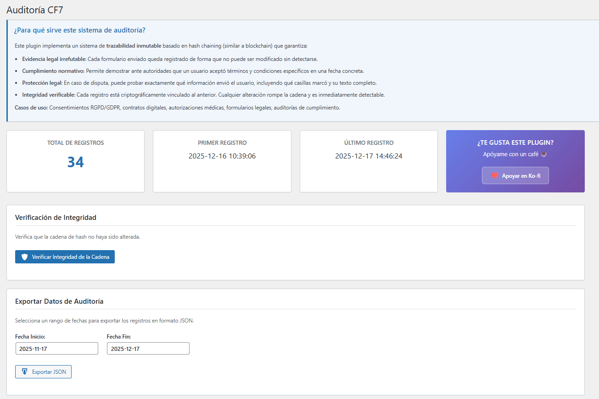
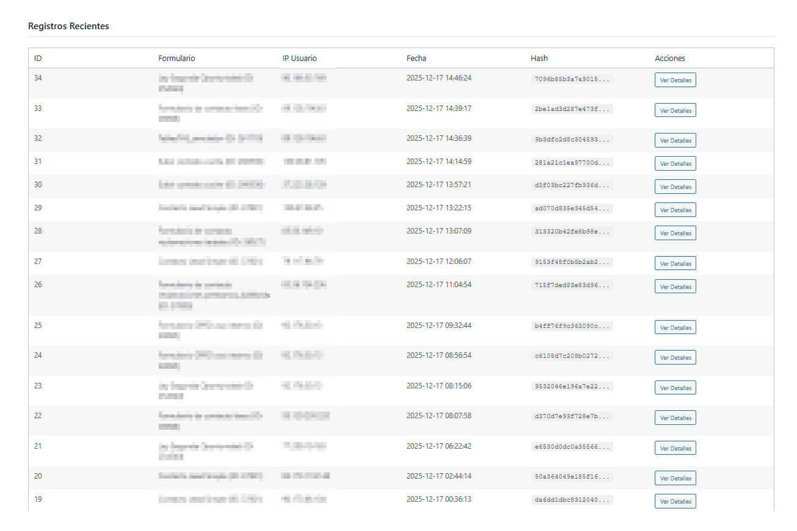
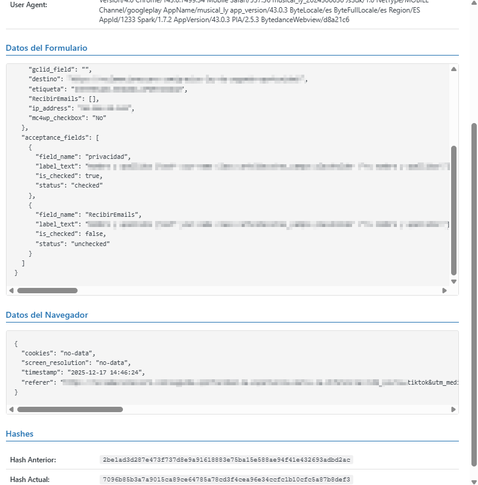

# ContactForm7 Audit


## ⚠️ REQUISITO OBLIGATORIO

**Este plugin requiere que [Contact Form 7](https://wordpress.org/plugins/contact-form-7/) esté instalado y activado para funcionar.**

Sin Contact Form 7, este plugin no tendrá ninguna funcionalidad. Asegúrate de instalar y activar Contact Form 7 antes de usar ContactForm7 Audit.

---

## ⚠️ DESCARGO DE RESPONSABILIDAD

**Este plugin ha sido desarrollado específicamente para proporcionar trazabilidad en auditorías ante denuncias o inspecciones relacionadas con formularios web.**

### Limitaciones de Responsabilidad

- El autor **NO SE HACE RESPONSABLE** de los resultados de ninguna auditoría realizada con este plugin.
- Este software se proporciona "TAL CUAL", sin garantías de ningún tipo, expresas o implícitas.
- El uso de este plugin **NO GARANTIZA** el cumplimiento de normativas legales específicas (GDPR, LOPD, etc.).
- Es responsabilidad del usuario final asegurarse de que el uso del plugin cumple con todas las leyes aplicables en su jurisdicción.
- El plugin captura datos sensibles (IP, cookies, User Agent). El responsable del sitio web debe:
  - Informar adecuadamente a los usuarios sobre la captura de datos
  - Obtener el consentimiento necesario
  - Cumplir con la legislación de protección de datos aplicable
  - Implementar medidas de seguridad adicionales

### Uso Recomendado

Este plugin está diseñado para situaciones donde se requiere evidencia técnica demostrable de:

- Envíos de formularios
- Consentimientos otorgados
- Cadena inmutabilidad de datos

**Consulte siempre con un asesor legal antes de implementar este sistema en producción.**

---

## 📋 Descripción

ContactForm7 Audit es un plugin de WordPress que proporciona **trazabilidad completa e inmutable** de todos los envíos de formularios Contact Form 7 mediante un sistema de hash chaining (similar a blockchain).

### Características Principales

- **Hash Chaining Criptográfico**: Cada registro está vinculado al anterior mediante SHA-256, creando una cadena inmutable
- **Trazabilidad Completa**: Captura todos los datos del formulario y contexto del usuario
- **Verificación de Integridad**: Sistema de validación que detecta cualquier alteración de datos
- **Exportación de Datos**: Exporta registros en formato JSON por rangos de fechas
- **Panel de Administración**: Visualiza estadísticas y registros recientes
- **Hash Génesis Documentado**: Punto de partida verificable de la cadena

### ¿Qué Datos Captura?

- ✅ Todos los campos del formulario
- ✅ Texto completo de casillas de aceptación (texto plano legible)
- ✅ Estado de las casillas (marcadas/no marcadas)
- ✅ Dirección IP del usuario (sin anonimizar)
- ✅ User Agent completo del navegador
- ✅ Cookies del dominio
- ✅ Resolución de pantalla
- ✅ Timestamp exacto del envío
- ✅ Hash del registro anterior

### 🔐 Evidencia Sólida y Verificable

**Este sistema de auditoría, combinado con la custodia del correo electrónico recibido por Contact Form 7, genera una evidencia extremadamente sólida de lo que el usuario rellenó en el formulario.**

La doble verificación (hash chain inmutable + correo electrónico recibido) proporciona:

- **Trazabilidad técnica irrefutable**: La cadena de hash garantiza que los datos no han sido modificados
- **Evidencia documental**: El correo electrónico generado por Contact Form 7 actúa como prueba independiente
- **Correlación temporal**: Timestamp del registro en base de datos vs. timestamp del email recibido
- **Validación cruzada**: Los datos almacenados en la cadena pueden ser contrastados con el contenido del email

Esta combinación hace prácticamente imposible negar o disputar el contenido enviado por el usuario, ya que se requeriría manipular simultáneamente:

1. La cadena criptográfica de hash en la base de datos
2. El servidor de correo electrónico receptor
3. Los registros de timestamp de ambos sistemas

---

## 🔧 Requisitos

- WordPress 5.0 o superior
- PHP 7.2 o superior
- Contact Form 7 activo e instalado
- Base de datos MySQL/MariaDB

---

## 📦 Instalación

1. Descarga el plugin o clona este repositorio
2. Sube la carpeta `contactform7-audit` a `/wp-content/plugins/`
3. Activa el plugin desde el menú 'Plugins' en WordPress
4. Asegúrate de que Contact Form 7 esté instalado y activo
5. Accede a "CF7 Audit" en el menú de administración

---

## 💻 Uso

### Panel de Administración

Una vez activado, encontrarás "CF7 Audit" en el menú lateral de WordPress:

- **Dashboard**: Estadísticas de envíos y verificación de integridad
- **Registros Recientes**: Últimos envíos con detalles completos
- **Exportar Datos**: Descarga registros en formato JSON por fechas
- **Verificación**: Valida la integridad de la cadena de hash



**Figura 1: Panel principal de administración del plugin CF7 Audit**

El panel muestra estadísticas de envíos, permite verificar la integridad de la cadena de hashes y exportar los datos en formato JSON.



**Figura 2: Listado de registros recientes de envíos de formularios**

La tabla muestra los envíos más recientes con información del formulario, IP del usuario, fecha y hash asociado. Cada registro puede consultarse en detalle.

### Verificación de Integridad

El plugin incluye un verificador automático que:

1. Recalcula todos los hashes de la cadena
2. Compara con los hashes almacenados
3. Detecta cualquier modificación o ruptura en la cadena
4. Muestra el estado de integridad en el panel

---

## 🔍 SECCIÓN PARA AUDITORES

Esta sección proporciona información técnica detallada para auditores, inspectores y profesionales técnicos que necesiten comprender el funcionamiento interno del plugin de forma transparente.

### Arquitectura del Sistema

#### 1. Estructura de Base de Datos

El plugin crea una tabla `wp_contactform_audit` con la siguiente estructura:

```sql
CREATE TABLE wp_contactform_audit (
    id BIGINT UNSIGNED AUTO_INCREMENT PRIMARY KEY,
    form_id BIGINT NOT NULL,
    form_name VARCHAR(255) NOT NULL,
    submission_data LONGTEXT NOT NULL,
    user_ip VARCHAR(45) NOT NULL,
    user_agent TEXT NOT NULL,
    browser_data TEXT,
    previous_hash VARCHAR(64) NOT NULL,
    current_hash VARCHAR(64) NOT NULL,
    created_at DATETIME DEFAULT CURRENT_TIMESTAMP,
    INDEX idx_created_at (created_at),
    INDEX idx_form_id (form_id),
    INDEX idx_current_hash (current_hash)
);
```

**Campos Clave:**

- `previous_hash`: Hash SHA-256 del registro anterior
- `current_hash`: Hash SHA-256 del registro actual
- `submission_data`: JSON con todos los campos del formulario
- `browser_data`: JSON con datos capturados del navegador

#### 2. Algoritmo de Hash Chaining

**Función de Hash:**

```php
hash('sha256', concatenated_string)
```

**Datos incluidos en el hash (en orden):**

1. `form_id` - ID del formulario
2. `form_name` - Nombre del formulario
3. `submission_data` - JSON completo de campos
4. `user_ip` - Dirección IP
5. `user_agent` - User Agent completo
6. `browser_data` - JSON de datos del navegador
7. `created_at` - Timestamp
8. `previous_hash` - Hash del registro anterior

**String concatenado:**

```
form_id|form_name|submission_data|user_ip|user_agent|browser_data|created_at|previous_hash
```

#### 3. Hash Génesis

El primer registro de la cadena usa un **hash génesis predefinido**:

```
0000000000000000000000000000000000000000000000000000000000000000
```

Este hash está hardcodeado en el código fuente (`class-hash-chain.php`, línea 22) y sirve como punto de partida verificable de la cadena.



**Figura 3: Detalle técnico de un registro mostrando la cadena de hashes**

Vista detallada de un registro individual donde se puede observar el hash anterior (previous hash) y el hash actual (current hash), permitiendo verificar la integridad de la cadena completa. También muestra los datos del formulario, información del navegador y metadatos capturados.

#### 4. Captura de Datos del Navegador

**JavaScript:** `public/js/browser-capture.js`

El plugin inyecta JavaScript que captura:

```javascript
{
    "cookies": document.cookie,
    "screen_resolution": "1920x1080",
    "timestamp": "2025-12-16T10:30:45.123Z"
}
```

Estos datos se envían mediante un campo oculto `_browser_data` en el formulario.

#### 5. Proceso de Validación de Integridad

El verificador de integridad (`admin/class-admin.php`) realiza:

1. **Recupera todos los registros** ordenados por ID
2. **Para cada registro:**
   - Extrae el `previous_hash` declarado
   - Recalcula el hash usando los datos almacenados
   - Compara el hash calculado con el `current_hash` almacenado
3. **Verifica la cadena:**
   - El `previous_hash` del registro N debe coincidir con el `current_hash` del registro N-1
4. **Reporta:**
   - Total de registros verificados
   - Registros con discrepancias (si existen)
   - Estado general de la cadena (íntegra/corrupta)

#### 6. Ubicación de Archivos Clave

**Lógica principal de hash chaining:**

- `includes/class-hash-chain.php` - Clase que maneja toda la lógica de hash

**Captura de envíos:**

- `includes/class-form-handler.php` - Intercepta envíos de CF7 y guarda datos

**Captura de datos del navegador:**

- `public/js/browser-capture.js` - JavaScript que captura cookies, resolución, etc.

**Panel de administración:**

- `admin/class-admin.php` - Interfaz de administración, estadísticas y verificación

**Activación/Desactivación:**

- `includes/class-activator.php` - Crea tabla en activación
- `includes/class-deactivator.php` - Limpieza en desactivación
- `uninstall.php` - Eliminación completa de datos

### Verificación Manual de la Cadena

Para verificar manualmente la integridad de la cadena:

#### Opción 1: Mediante el Panel de Administración

1. Accede a WordPress Admin → CF7 Audit
2. Haz clic en "Verificar Integridad de la Cadena"
3. El sistema mostrará:
   - Total de registros verificados
   - Estado de cada registro
   - Cualquier discrepancia detectada

#### Opción 2: Consulta SQL Directa

```sql
-- Verificar que cada previous_hash coincida con el current_hash anterior
SELECT
    a.id,
    a.previous_hash AS declarado,
    LAG(a.current_hash) OVER (ORDER BY a.id) AS real,
    CASE
        WHEN a.previous_hash = LAG(a.current_hash) OVER (ORDER BY a.id) THEN 'OK'
        WHEN a.id = (SELECT MIN(id) FROM wp_contactform_audit) THEN 'GENESIS'
        ELSE 'ERROR'
    END AS estado
FROM wp_contactform_audit a
ORDER BY a.id;
```

#### Opción 3: Script PHP de Verificación

```php
// Recalcular hash de un registro específico
$record_id = 123; // ID del registro a verificar

global $wpdb;
$table = $wpdb->prefix . 'contactform_audit';

$record = $wpdb->get_row("SELECT * FROM $table WHERE id = $record_id");

$hash_string =
    $record->form_id . '|' .
    $record->form_name . '|' .
    $record->submission_data . '|' .
    $record->user_ip . '|' .
    $record->user_agent . '|' .
    $record->browser_data . '|' .
    $record->created_at . '|' .
    $record->previous_hash;

$calculated_hash = hash('sha256', $hash_string);

echo "Hash almacenado: " . $record->current_hash . "\n";
echo "Hash calculado:  " . $calculated_hash . "\n";
echo "Coincide: " . ($record->current_hash === $calculated_hash ? 'SÍ' : 'NO');
```

### Formato de Exportación JSON

Cuando se exportan datos, el formato JSON es:

```json
{
  "export_info": {
    "plugin_version": "1.0.2",
    "export_date": "2025-12-16 10:30:45",
    "date_from": "2025-01-01",
    "date_to": "2025-12-31",
    "total_records": 150
  },
  "genesis_hash": "0000000000000000000000000000000000000000000000000000000000000000",
  "records": [
    {
      "id": 1,
      "form_id": 123,
      "form_name": "Formulario de contacto",
      "submission_data": {
        "nombre": "Juan Pérez",
        "email": "juan@example.com",
        "mensaje": "Consulta sobre producto",
        "aceptacion": {
          "text": "Acepto la política de privacidad",
          "value": "1"
        }
      },
      "user_ip": "192.168.1.100",
      "user_agent": "Mozilla/5.0...",
      "browser_data": {
        "cookies": "cookie1=value1; cookie2=value2",
        "screen_resolution": "1920x1080"
      },
      "previous_hash": "0000000000000000000000000000000000000000000000000000000000000000",
      "current_hash": "a1b2c3d4e5f6...",
      "created_at": "2025-01-15 14:23:10"
    }
  ]
}
```

### Consideraciones de Seguridad

**Fortalezas:**

- ✅ Inmutabilidad mediante hash chaining
- ✅ Algoritmo SHA-256 (estándar de la industria)
- ✅ Validación de integridad automatizada
- ✅ Captura completa de contexto

**Limitaciones y Riesgos:**

- ⚠️ Los datos se almacenan en la base de datos de WordPress (protección depende de la seguridad del servidor)
- ⚠️ No hay cifrado de datos en reposo (datos sensibles visibles en BD)
- ⚠️ JavaScript del cliente puede ser bloqueado o modificado
- ⚠️ IP puede ser suplantada mediante proxies/VPN
- ⚠️ User Agent puede ser falsificado
- ⚠️ No hay firma digital externa (el sistema es autocontenido)

### Recomendaciones para Auditorías

1. **Verificar la integridad de la cadena** antes de cualquier análisis
2. **Exportar los datos JSON** inmediatamente al recibir una solicitud
3. **Documentar el hash génesis** del sistema
4. **Revisar logs del servidor** para detectar accesos no autorizados a la BD
5. **Comparar timestamps** de la BD con logs del servidor
6. **Validar** que Contact Form 7 esté correctamente configurado
7. **Revisar el código fuente** del plugin para descartar modificaciones

### Contacto Técnico

Para consultas técnicas sobre el funcionamiento del plugin:

- **Autor**: Rubén García
- **LinkedIn**: [www.linkedin.com/in/ruben-garcia-4383853a](https://www.linkedin.com/in/ruben-garcia-4383853a)
- **Repository**: [github.com/espunny/Plugin-Trazabilidad-formularios](https://github.com/espunny/contactform7-audit)

---

## 📄 Licencia

Este plugin está licenciado bajo GPL v2 o posterior.

```
This program is free software; you can redistribute it and/or modify
it under the terms of the GNU General Public License as published by
the Free Software Foundation; either version 2 of the License, or
(at your option) any later version.

This program is distributed in the hope that it will be useful,
but WITHOUT ANY WARRANTY; without even the implied warranty of
MERCHANTABILITY or FITNESS FOR A PARTICULAR PURPOSE. See the
GNU General Public License for more details.
```

**Copyright © 2025 Rubén García**

---

## 🤝 Contribuciones

Las contribuciones son bienvenidas. Por favor:

1. Fork el proyecto
2. Crea una rama para tu función (`git checkout -b feature/AmazingFeature`)
3. Commit tus cambios (`git commit -m 'Add some AmazingFeature'`)
4. Push a la rama (`git push origin feature/AmazingFeature`)
5. Abre un Pull Request

---

## ⚖️ Aviso Legal Final

**ESTE SOFTWARE SE PROPORCIONA POR EL AUTOR "TAL CUAL" Y CUALQUIER GARANTÍA EXPRESA O IMPLÍCITA, INCLUYENDO, PERO NO LIMITADO A, LAS GARANTÍAS IMPLÍCITAS DE COMERCIABILIDAD Y APTITUD PARA UN PROPÓSITO PARTICULAR SON RECHAZADAS. EN NINGÚN CASO EL AUTOR SERÁ RESPONSABLE POR DAÑOS DIRECTOS, INDIRECTOS, INCIDENTALES, ESPECIALES, EJEMPLARES O CONSECUENTES (INCLUYENDO, PERO NO LIMITADO A, LA ADQUISICIÓN DE BIENES O SERVICIOS SUSTITUTOS; PÉRDIDA DE USO, DATOS O BENEFICIOS; O INTERRUPCIÓN DE NEGOCIO) CAUSADOS Y BAJO CUALQUIER TEORÍA DE RESPONSABILIDAD, YA SEA POR CONTRATO, RESPONSABILIDAD ESTRICTA O AGRAVIO (INCLUYENDO NEGLIGENCIA O CUALQUIER OTRA) QUE SURJA DE CUALQUIER MANERA DEL USO DE ESTE SOFTWARE, INCLUSO SI SE ADVIERTE DE LA POSIBILIDAD DE TAL DAÑO.**

El uso de este plugin implica la aceptación de estos términos.

---

<sub>_Para Dafne, con amor._</sub>
